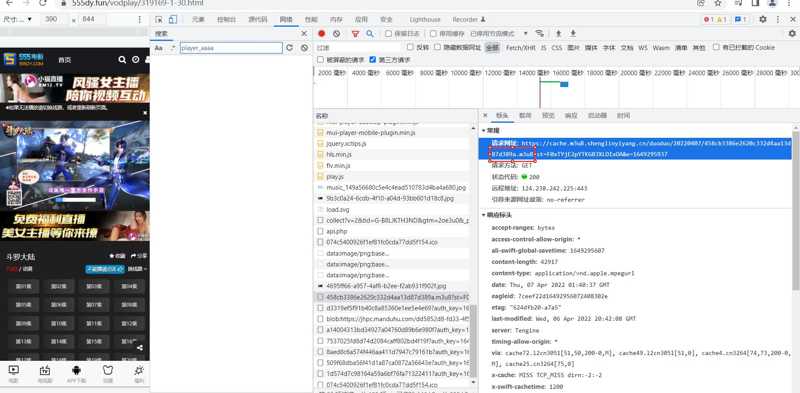
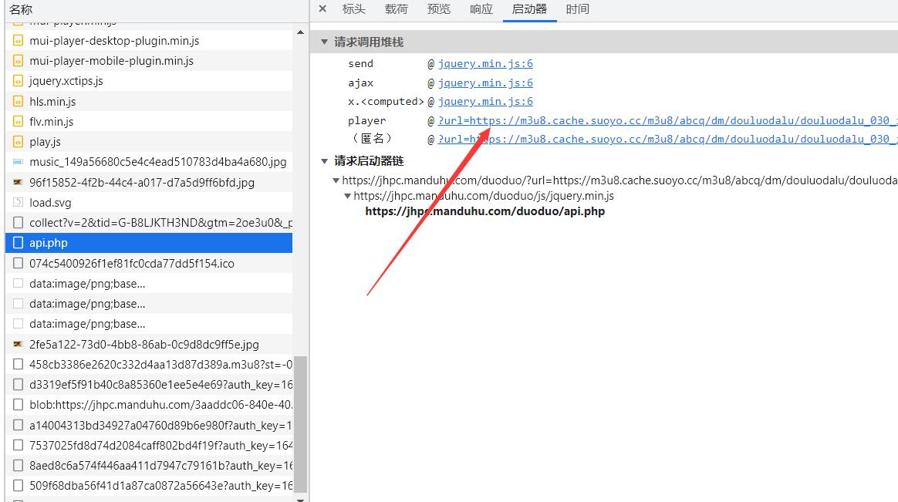
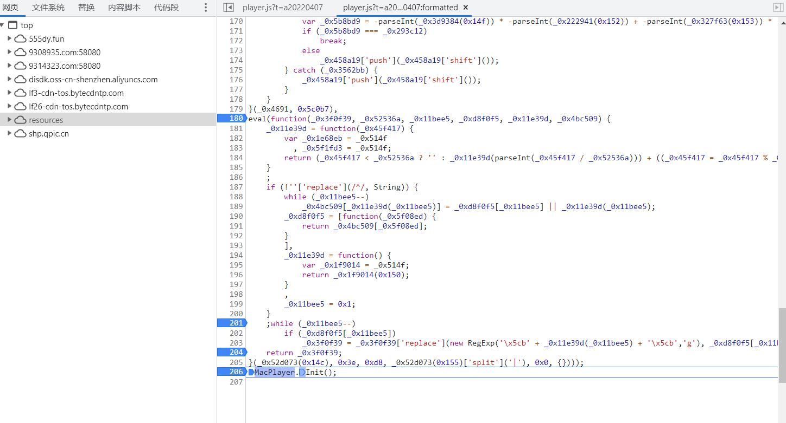

# 555dy.fun 视频站解析

js 逆向过程较为复杂但不是很难，小白可以直接下滑看最后成品

## 工具

chrome 浏览器

打开网址 ：https://555dy.fun/vodplay/319169-1-30.html

## 浏览器打开开发者工具，按F12，刷新

浏览了下，看见能获得可以用的 m3u8链接：https://cache.m3u8.shenglinyiyang.cn/duoduo/20220407/458cb3386e2620c332d4aa13d87d389a.m3u8?st=F0xTYjE2pYTKG0JXLDIxOA&e=1649295937



到这里其实可以直接下载了，传入m3u8下载器即可，这里我自写了一个 [hecoter/m3u8download_hecoter: python m3u8 下载 (github.com)](https://github.com/hecoter/m3u8download_hecoter)

但是为了实现批量下载，还需要分析他的加密参数，链接里的st=F0xTYjE2pYTKG0JXLDIxOA 搜索没搜到，说明是从某个地方解密来的，往上看，很明显有个 api.php

## api.php 内容解密

```
url = 'https://jhpc.manduhu.com/duoduo/api.php'
post
data = {
    'url':'https://m3u8.cache.suoyo.cc/m3u8/abcq/dm/douluodalu/douluodalu_030_index.m3u8'
}
内容：{"code":200,"parser":"ysgc","msg":"success","url":"DLJuGFol+m6NMEznRGwUnoZkAycE1n4Wni\/ZlmaCDntBuTe8ZkBdpEciE79wS8CMfwQFRNDTXLENg2ZrdbfZQ2T38PBCDHOaADw97Cz2zmKPgSIJxj\/fUZO+\/jYo4hThGt3YS0GO++p+BtZ+uiHNr7UeLqPUEea5QlF2MWf16iADcqBwGhozrXFEYOa7JLqn","type":"hls","player":"dplayer","from":"ddjson-dd"}
```

猜测 加密的url 就是链接，同时这里多了一个未知链接：https://m3u8.cache.suoyo.cc/m3u8/abcq/dm/douluodalu/douluodalu_030_index.m3u8



切到这里看加密，跳到 play.js

*此处省略一万行* ，只截取关键部分，其实整个js 文件复制下来是可以直接用的，但是此次主要分析算法

```
function getVideoInfo(_0x138809) {
var _0x66200d = {
    'SmmHy': function(_0x37b942) {
        return _0x37b942();
    },
    'FgXIE': 'rXjWvXl6',
    'dXQUS': _0x3413('‮c78', 'fe0Y')
};
var _0x55aca2 = _0x66200d[_0x3413('‮c79', '(ImK')](crypt);
var _0x11ea39 = _0x55aca2[_0x3413('‫c7a', 'D!aR')](_0x66200d['FgXIE']);
_0x11ea39 = _0x55aca2[_0x3413('‫c7b', 'FFw[')]['Utf8']['parse'](_0x11ea39);
var _0x496787 = _0x55aca2[_0x3413('‮c7c', 'oyT$')][_0x3413('‫c7d', 'Z]q0')]['parse'](_0x66200d['dXQUS']);
var _0x303919 = _0x55aca2[_0x3413('‫c7e', 'pFSv')][_0x3413('‮c7f', 'jWMi')](_0x138809, _0x11ea39, {
    'iv': _0x496787,
    'mode': _0x55aca2[_0x3413('‫c80', '2iRH')]['CBC'],
    'padding': _0x55aca2[_0x3413('‫c81', 'WB5o')]['ZeroPadding']
});
var _0x53c78f = _0x303919['toString'](_0x55aca2[_0x3413('‫c82', 'TLkZ')]['Utf8']);
return _0x53c78f;
```


得key,iv ,data

key: 6461633263303839303464333031316666393035363463396637373836356366
		iv: 4e5862486f574a627073454f696e3862

```
def getVideoInfo(data):
    key = '6461633263303839303464333031316666393035363463396637373836356366'
    # key1 = 'dac2c08904d3011ff90564c9f77865cf'
    iv = '4e5862486f574a627073454f696e3862'
    cryptor = AES.new(key=bytes.fromhex(key),mode=AES.MODE_CBC,IV=bytes.fromhex(iv))
    m3u8url = cryptor.decrypt(base64.b64decode(data)).decode('UTF-8', 'ignore').strip().strip(b'\x00'.decode())
    return m3u8url
```

## player_aaaa 中初始m3u8链接的生成

上面分析中看见一个未知链接 ：https://m3u8.cache.suoyo.cc/m3u8/abcq/dm/douluodalu/douluodalu_030_index.m3u8

同样搜索也是没找到

在config 那里一步一步向上走，终于找到突破点, MacPlayer.Init()



这段格式化看下，

```
var MacPlayer = {
    'GetDate': function(f, t) {
        if (!t) {
            t = new Date()
        }
        var a = ['日', '一', '二', '三', '四', '五', '六'];
        f = f.replace(/yyyy|YYYY/, t.getFullYear());
        f = f.replace(/yy|YY/, (t.getYear() % 100) > 9 ? (t.getYear() % 100).toString() : '0' + (t.getYear() % 100));
        f = f.replace(/MM/, t.getMonth() > 9 ? t.getMonth().toString() : '0' + t.getMonth());
        f = f.replace(/M/g, t.getMonth());
        f = f.replace(/w|W/g, a[t.getDay()]);
        f = f.replace(/dd|DD/, t.getDate() > 9 ? t.getDate().toString() : '0' + t.getDate());
        f = f.replace(/d|D/g, t.getDate());
        f = f.replace(/hh|HH/, t.getHours() > 9 ? t.getHours().toString() : '0' + t.getHours());
        f = f.replace(/h|H/g, t.getHours());
        f = f.replace(/mm/, t.getMinutes() > 9 ? t.getMinutes().toString() : '0' + t.getMinutes());
        f = f.replace(/m/g, t.getMinutes());
        f = f.replace(/ss|SS/, t.getSeconds() > 9 ? t.getSeconds().toString() : '0' + t.getSeconds());
        f = f.replace(/s|S/g, t.getSeconds());
        return f
    },
    'GetUrl': function(s, n) {
        return this.Link.replace('{sid}', s).replace('{sid}', s).replace('{nid}', n).replace('{nid}', n)
    },
    'Go': function(s, n) {
        location.href = this.GetUrl(s, n)
    },
    'Show': function() {
        $('#buffer').attr('src', this.Prestrain);
        setTimeout(function() {
            MacPlayer.AdsEnd()
        }, this.Second * 1000);
        $("#playleft").get(0).innerHTML = this.Html + '';
        if (!/(Win|Mac)/i.test(navigator.platform)) {
            var a = document.createElement('script');
            a.type = 'text/javascript';
            a.async = true;
            a.charset = 'utf-8';
            a.src = base64decode('Ly91bmlvbi5tYWNjbXMubGEvaHRtbC90b3AxMC5qcw==') + '?r=' + this.GetDate('yyyyMMdd');
            var b = document.getElementsByTagName('script')[0];
            b.parentNode.insertBefore(a, b)
        }
    },
    'AdsStart': function() {
        if ($("#buffer").attr('src') != this.Buffer) {
            $("#buffer").attr('src', this.Buffer)
        }
        $("#buffer").show()
    },
    'AdsEnd': function() {
        $('#buffer').hide()
    },
    'Install': function() {
        this.Status = false;
        $('#install').show()
    },
    'Play': function() {
        document.write('<style>.MacPlayer{background: #000000;font-size:14px;color:#F6F6F6;margin:0px;padding:0px;position:relative;overflow:hidden;width:' + this.Width + ';height:' + this.Height + ';min-height:100px;}.MacPlayer table{width:100%;height:100%;}.MacPlayer #playleft{position:inherit;!important;width:100%;height:100%;}</style><div class="MacPlayer">' + '<iframe id="buffer" src="" frameBorder="0" scrolling="no" width="100%" height="100%" style="position:absolute;z-index:99998;"></iframe><iframe id="install" src="" frameBorder="0" scrolling="no" width="100%" height="100%" style="position:absolute;z-index:99998;display:none;"></iframe>' + '<table border="0" cellpadding="0" cellspacing="0"><tr><td id="playleft" valign="top" style="">&nbsp;</td></table></div>');
        this.offsetHeight = $('.MacPlayer').get(0).offsetHeight;
        this.offsetWidth = $('.MacPlayer').get(0).offsetWidth;
        document.write('<scr' + 'ipt src="' + this.Path + this.PlayFrom + '.js"></scr' + 'ipt>')
    },
    'Down': function() {},
    'Init': function() {
        this.Status = true;
        this.Parse = '';
        var a = player_aaaa;
        if (a.encrypt == '1') {
            a.url = unescape(a.url);
            a.url_next = unescape(a.url_next)
        } else if (a.encrypt == '2') {
            a.url = unescape(base64decode(a.url));
            a.url_next = unescape(base64decode(a.url_next))
        }
        this.Agent = navigator.userAgent.toLowerCase();
        this.Width = MacPlayerConfig.width;
        this.Height = MacPlayerConfig.height;
        if (this.Agent.indexOf("android") > 0 || this.Agent.indexOf("mobile") > 0 || this.Agent.indexOf("ipod") > 0 || this.Agent.indexOf("ios") > 0 || this.Agent.indexOf("iphone") > 0 || this.Agent.indexOf("ipad") > 0) {
            this.Width = MacPlayerConfig.widthmob;
            this.Height = MacPlayerConfig.heightmob
        }
        if (this.Width.indexOf("px") == -1 && this.Width.indexOf("%") == -1) {
            this.Width = '100%'
        }
        if (this.Height.indexOf("px") == -1 && this.Height.indexOf("%") == -1) {
            this.Height = '100%'
        }
        this.Prestrain = MacPlayerConfig.prestrain;
        this.Buffer = MacPlayerConfig.buffer;
        this.Second = MacPlayerConfig.second;
        this.Flag = a.flag;
        this.Trysee = a.trysee;
        this.Points = a.points;
        this.Link = decodeURIComponent(a.link);
        this.PlayFrom = a.from;
        this.PlayNote = a.note;
        this.PlayServer = a.server == 'no' ? '' : a.server;
        this.PlayUrl = a.url;
        this.PlayUrlNext = a.url_next;
        this.PlayLinkNext = a.link_next;
        this.PlayLinkPre = a.link_pre;
        this.Id = a.id;
        this.Sid = a.sid;
        this.Nid = a.nid;
        if (MacPlayerConfig.server_list[this.PlayServer] != undefined) {
            this.PlayServer = MacPlayerConfig.server_list[this.PlayServer].des
        }
        if (MacPlayerConfig.player_list[this.PlayFrom] != undefined) {
            if (MacPlayerConfig.player_list[this.PlayFrom].ps == "1") {
                this.Parse = MacPlayerConfig.player_list[this.PlayFrom].parse == '' ? MacPlayerConfig.parse : MacPlayerConfig.player_list[this.PlayFrom].parse;
                this.PlayFrom = 'parse'
            }
        }
        this.Path = maccms.path + '/static/player/';
        if (this.Flag == "down") {
            MacPlayer.Down()
        } else {
            MacPlayer.Play()
        }
    }
};

```

发现是 player_aaaa 中的值经过 unescape 解码得到内容，但是  player_aaaa 又找不到了……

## player_aaaa

发现直接请求 网址就可得到

## 完整代码

[hecoter/videoParse: 一些视频解析网址解密 (github.com)](https://github.com/hecoter/videoParse)

成品：https://github.com/hecoter/videoParse/releases/download/V.10/videoParser.zip

